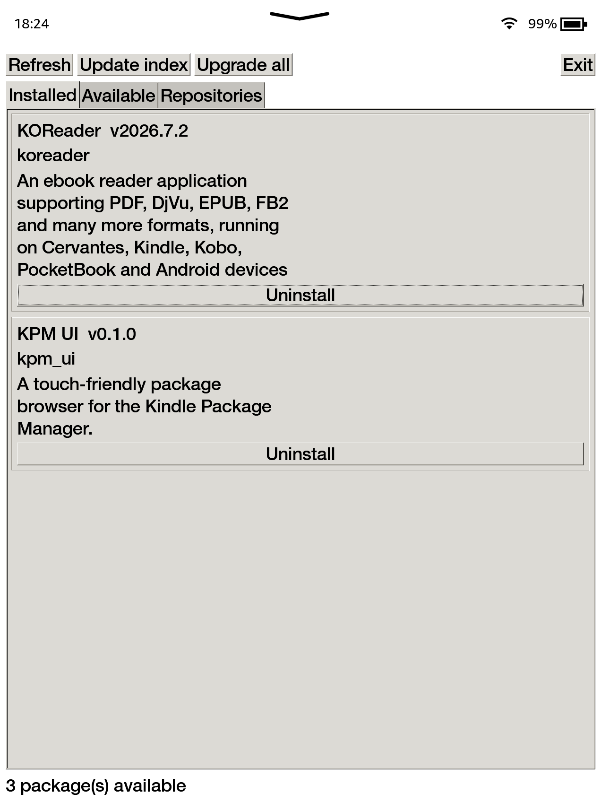
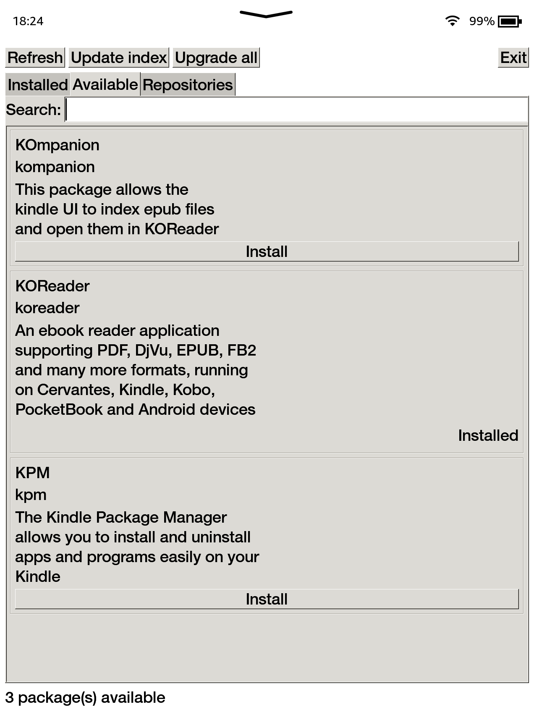
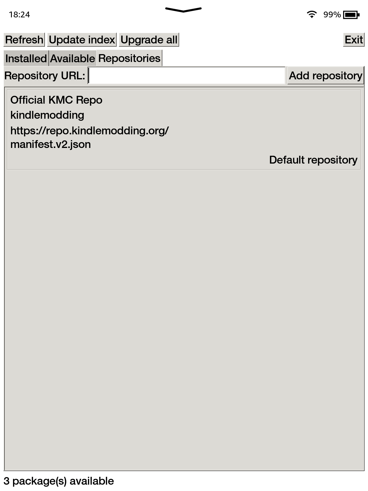

# KPM UI

A touch-friendly GTK frontend for the [Kindle Package Manager](https://kindlemodding.org/kindle-dev/kpm/index.html). KPM UI can browse, install, update, and remove packages and repositories on `kindlehf` devices running firmware 5.16.3 or newer.

<p align="center">
  
  
  
</p>

## Install

Your Kindle must be jailbroken with KPM installed. (e.g. Vera Jailbreak)

1. Download the `.kpkg` and `Install KPM UI.sh` from [GitHub Releases](https://github.com/LLukas22/KPM-UI/releases).
2. Connect the Kindle over USB and place both files in its `documents` folder.
3. Disconnect the Kindle, wait for **Install or Update KPM UI** to appear in the library, and open it.

The installer removes the downloaded files after a successful installation. **KPM UI** will then appear in the library; reboot once if either Scriptlet is not indexed.

## Uninstall

1. Download `Uninstall KPM UI.sh` from [GitHub Releases](https://github.com/LLukas22/KPM-UI/releases).
2. Connect the Kindle over USB and place it in its `documents` folder.
3. Disconnect the Kindle, wait for **Uninstall KPM UI** to appear in the library, and open it.

## Development

Install [Nix](https://nixos.org/download/) and [Just](https://just.systems/), then clone the repository with its submodules. The Just recipes automatically use the pinned Nix environment.

```sh
just check    # Format, lint, and test
```

If you want to run the app on your desktop for testing, you can create and use a sandbox via the following command:

```sh
just desktop  # Run the GTK app locally in a sandbox
```

To deploy a development build, connect the Kindle via MTP, then run:

```sh
just install  # First development installation
just update   # Replace an existing development build
```

Disconnect the Kindle and open the temporary install or update Scriptlet from its library.


To uninstall a development build, simply run:

```sh
just uninstall  # Remove a development build
```

Disconnect the Kindle and open the temporary uninstall Scriptlet from its library.
